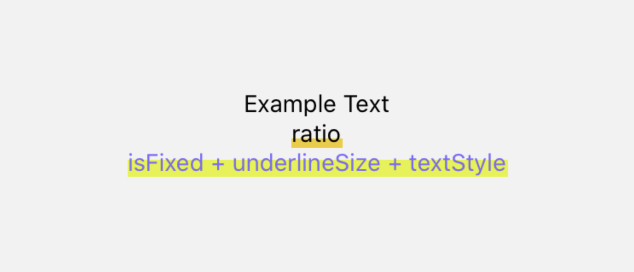

## React Native Highlight Underline Text

- 텍스트 밑줄 그려주는 컴포넌트
- 여러줄 가능

## Installation
```
npm install react-native-highlight-underline-text
yarn add react-native-highlight-underline-text
```

## Example

```jsx
<Text>Example Text</Text>
<HighlightText ratio={0.3} text="ratio" />
<HighlightText
  isFixed
  underlineSize={10}
  underlineColor="#e3f42d"
  textStyle={{ fontSize: 14, color: '#7d66fe' }}
  text="isFixed + underlineSize + textStyle"
/>
```

## Usage
```jsx
import HighlightText from 'react-native-highlight-underline-text';

<HighlightText text="Hightlight Underline Text">

<HighlightText
  isFixed={false}
  underlineSize={0}
  bottom={4}
  ratio={0.3}
  underlineColor='#ec2'
  textStyle={{
    color: '#333333',
    fontSize: 30,
  }}
  text="Custom Highlight Underline Text"
/>
```

## Props
| Property | Type    | Description |
|:---------|:-------:|:------------|
| isFixed  | Boolean | 텍스트 크기에 영향받지 않는 밑줄 사이즈 고정 여부 |
| underlineSize     | Number  | isFixed=true 일때 밑줄 사이즈 |
| bottom   | Number  | 밑줄이 시작되는 텍스트 영역 |
| ratio    | Number  | isFixed=false 일때 텍스트 크기에 대한 밑줄이 차지하는 비율 |
| underlineColor    | String  | 밑줄 색상 |
| textStyle | StyleProp<TextStyle> | 텍스트 스타일 |